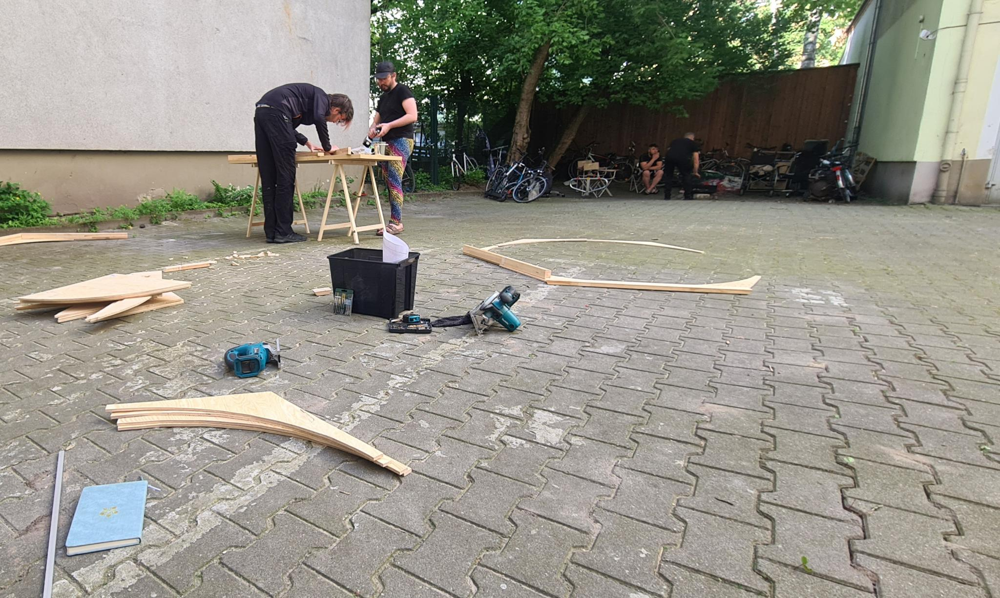
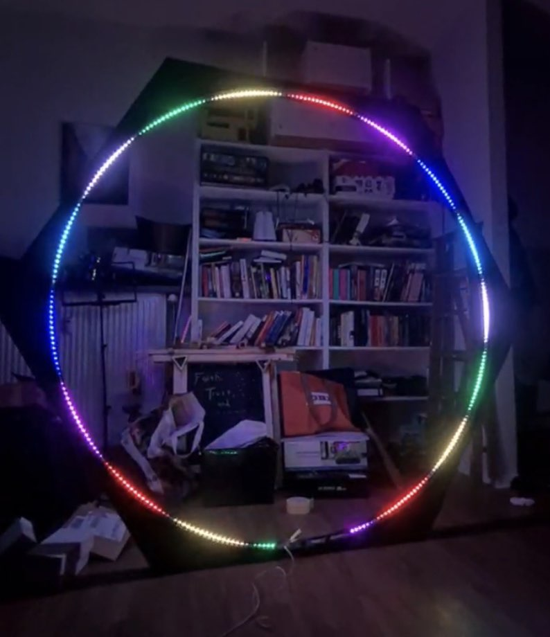

We spent some time cutting the pieces to assemble the first hexagon. A couple of people came to help out with the laying out of the pattern and cutting. The braces were cut from plywood, and the edges were cut from some framing lumber. We managed to get the first one completely built and installed a strip of lights from an earlier pathfinder version.

Amy spent the next couple of days laying down primer and painting the frame with a nice glittery effect.