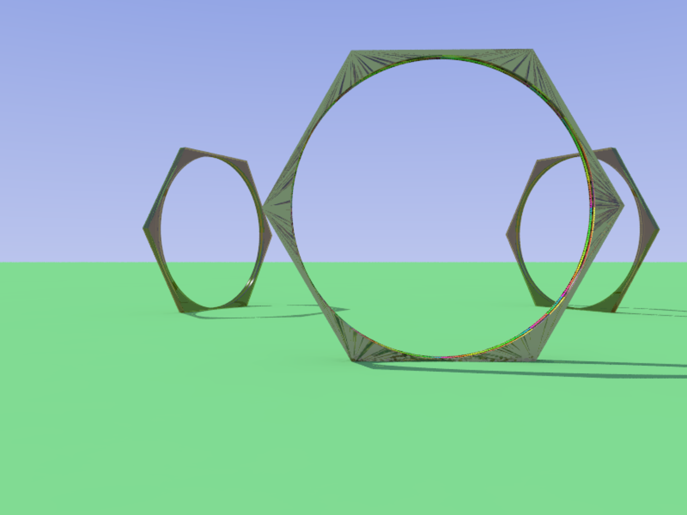

# Shifting Spectrums

Shifting Spectrums is constructed using a series of 3 large hexagonal structures, each of which is made out of wood and embedded with LED lights. The hexagons are designed to be sturdy and visually striking. They are large enough to walk through and are connected to a central control system. When participants touch the control surface and interact with one another, the colors of the LEDs can change in real-time, creating a dynamic and interactive experience that responds to the tactile input from participants. This control system is programmed with various color schemes and patterns, which can be triggered by different types of touch and interaction. The hexagons are arranged in a modular way, allowing for a variety of configurations and layouts depending on the space and context of the installation.

# Artist Statement
Shifting Spectrums is a multi-sensory experience that explores the relationship between humans and technology. The centerpiece of the installation consists of 3 large hexagonal structures embedded with LED lights, which change color in response to touch by one or multiple people.

The hexagonal shape is a nod to the natural world and its tendency towards efficient, geometric patterns. The LED lights within each hexagon are capable of producing a wide range of colors, allowing for endless possibilities of hue and dynamic patterns. By interacting with the touch sensors and simultaneously interacting with one another, participants can activate the LED lights, causing them to shift and change in response to the pressure and movement of their hands.

The interactive nature of the installation invites everyone to engage with the artwork in a physical and tactile way, blurring the boundaries between observer and participant. As the hexagons change color, participants can observe the effects of their actions and the actions of others, creating a sense of shared experience and collaboration.

With Shifting Spectrums, we seek to create a space that encourages exploration, playfulness, and connection. Through the use of technology and tactile engagement, the installation invites visitors to connect with both the natural and digital worlds in new and unexpected ways.

# Components
## CAD Fils
The [structures](./cad) are parametrically designed using [FreeCAD](https://www.freecad.org/index.php?lang=en)

## TouchMe Controller
[TouchMe Controller](https://shop.playtronica.com/products/touchme)

TouchMe is a MIDI controller using touch as the input. We are remapping the MIDI notes to control various parameters on the lights.

## Chataigne
[Chataigne](https://benjamin.kuperberg.fr/chataigne/en)

We are using Chataigne to orchestrate the data from the TouchMe to control WLED.

## WLED
[WLED](https://kno.wled.ge/)

WLED is a spiffy esp32 firmware for controlling lights.